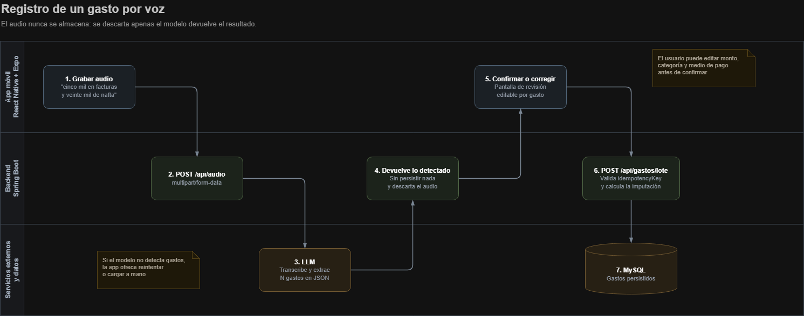

# Pocket-API

Pocket es una aplicación **mobile** de finanzas personales cuyo diferencial es el
**registro de gastos por voz**. El usuario graba un audio en lenguaje natural
("gasté cinco mil en bizcochos y veinte mil de nafta"); una IA transcribe y
extrae la información estructurada, pudiendo detectar **N gastos en un solo
audio**. El usuario confirma o corrige antes de persistir.

La app organiza los gastos, los visualiza en gráficos, detecta **gastos
hormiga**, compara contra el **promedio histórico** y calcula la **capacidad de
ahorro**. Separa gastos de **débito** (efectivo, transferencia, tarjeta de
débito) de gastos de **crédito** (con soporte de cuotas), y permite ver todos
los montos convertidos a **dólar blue**.

**Objetivo de producto:** reducir al mínimo la fricción del registro para que el
usuario sostenga el hábito. Hablar en vez de tipear.

---

## Cómo funciona

El audio se descarta apenas se procesa: nunca se almacena.

---

## Stack

**Backend** · Java 21 · Spring Boot 3.5 · MySQL 8.4 · Flyway · JWT · Gemini  
**Mobile** · React Native · TypeScript · Expo  
**Deploy** · Railway  

---

## Decisiones de diseño que vale la pena mirar

**Una cuota es un gasto.** No hay tabla de cuotas. Una compra en 6 cuotas
inserta 6 filas en `gasto` con FK al padre y fecha de imputación futura. Eso
hace que el total del mes, el promedio y la capacidad de ahorro salgan de una
sola consulta, sin `UNION` ni lógica especial.

**Doble fecha.** Cada gasto guarda cuándo ocurrió y a qué mes se imputa. En
débito coinciden; en crédito no. Todos los reportes consultan por la segunda,
y así las cuotas caen solas en el mes que les toca.

**La última cuota absorbe el redondeo.** $12.500 en 9 cuotas no da exacto en
ninguna cantidad de decimales. Se redondea hacia abajo y la última cuota se
calcula como `total − (cuota × (n−1))`, así la suma cierra al centavo. Es lo
que hacen los bancos.

**Idempotencia en el alta.** La app funciona sin conexión y encola audios. Si
se corta la respuesta y el cliente reintenta, la `idempotencyKey` evita el
duplicado.

**Las reglas viven en configuración.** El umbral de gasto hormiga y los meses
mínimos para el promedio están en `application.yml`, no hardcodeados.

---
